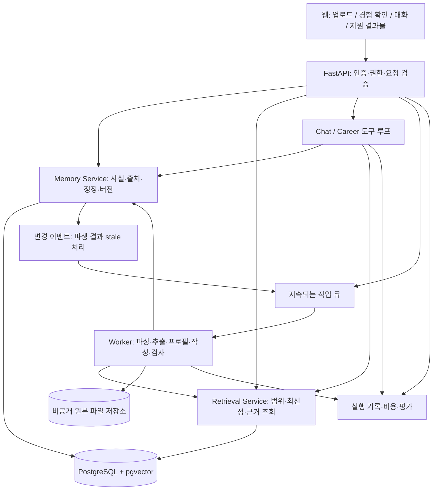

# SKIVE 고도화 설계와 실행 계획

작성일: 2026-09-22 · 대상: 현재 로컬 구현 → 2026년 12월 데모 및 소규모 학생 베타

## 1. 판단: 핵심 흐름은 만들었다. 이제 기억을 믿고 다시 쓸 수 있게 만들 차례다

현재 SKIVE는 단순한 화면 목업을 넘어섰다. 파일에서 경험을 추출하고, 여러 경험을 종합하고, 공고와 연결해 자소서를 작성하는 경로가 코드와 저장 결과로 존재한다. 이 구현을 버리고 새 프레임워크로 다시 시작할 이유는 없다.

다만 지금 단계에서 가장 중요한 일은 에이전트 수를 늘리는 것이 아니다. **사용자가 자료를 넣고, 잘못된 기억을 고치고, 며칠 뒤 다시 접속해 그 기억으로 실제 결과물을 만드는 흐름을 완성하는 것**이다. 특히 정정·근거·세션에 발견된 문제가 해결되지 않으면 기능을 늘릴수록 오래된 사실과 잘못된 검증 표시도 함께 확산된다.

추천 제품 정의는 다음과 같다.

> 대학생활의 자료와 본인 설명을 근거가 있는 경험 기록으로 쌓고, 그 기록으로 다음 준비 행동과 지원 결과물을 만드는 개인 에이전트.

12월까지의 현실적인 범위는 **경험 등록 → 역할 확인 → 경험 회상 → 공고별 매칭 → 근거를 추적할 수 있는 자소서·포트폴리오 → 재방문**이다. 대학생활 전체를 관리하는 학습·일정·채용검색 플랫폼은 그 이후 확장한다.

3천만 원을 전부 외주로 쓸 필요는 없다. 현재 코드 규모와 연결 상태를 보면 핵심 기능은 직접 고도화할 수 있는 범위다. 다만 일정 보장은 아니며, 아래 계획은 개발에 주당 약 25~35시간을 확보한다는 가정이다. 외부 도움은 독립적인 보안 검토, 사용자 경험 검증, 납품 품질 점검처럼 혼자서는 놓치기 쉬운 부분부터 쓰는 편이 좋다.

## 2. 이번 검토에서 확인한 범위

### 실제로 확인한 것

- `PROJECT_STATUS.md`, `SCHEMA.md`, 붙여넣은 전체 구상안, 패키지·마이그레이션 구조와 주요 구현 전체 흐름.
- `skive/`의 Python 파일 25개, 합계 2,575줄. `ui_mockup/skive_ui.html` 961줄.
- 저장된 경험 6건, 행동·의사결정·결과 사실 총 33건, 공부 세션 2건, 공고 처리 결과 2건.
- 저장된 문항 결과 5개: `통과` 1개, `정제` 2개, `근거부족` 2개. 현재 생성물을 읽은 결과이며 이번에 생성 실험을 다시 돌린 결과는 아니다.
- 메타데이터의 인용 검사 집계는 41/41. **인용문 검사 통과 수이지, 사실 정확도 100%라는 뜻이 아니다.**
- `http://localhost:8010/`, `/openapi.json`, `/api/experiences`, `/api/profile`, `/api/jobs`, `/api/study`의 GET 응답 모두 HTTP 200.
- LLM·DB·파일 쓰기를 대체한 격리된 함수 진단으로 아래 주요 문제를 재현했다. 원본 경험 데이터는 수정하지 않았다.
- 첨부 논문 세 편의 설계·실험·한계를 읽고, 핵심 구조 그림은 PDF 렌더링으로 확인했다.

### 이번에 확인하지 않은 것

- 브라우저 자동화에 연결된 브라우저가 없어 실제 클릭·모바일 레이아웃·스크린 리더 동작은 확인하지 않았다. 화면 관련 판단은 서빙되는 HTML/JS와 API 응답을 근거로 한다.
- 실제 LLM 호출을 이용한 신규 경험 분석, 전체 자소서 생성, 장시간 대화 품질, 동시 접속 부하는 재실행하지 않았다.
- 현재 Supabase의 실제 테이블별 행 수·RLS 설정·백업 상태는 확인하지 않았다. DB 관련 현황은 코드와 마이그레이션 기준이다.
- 사업 협약서·예산 집행 지침·정확한 제출일은 제공되지 않았다. 12월 목표는 `PROJECT_STATUS.md` 기준이며 공식 사업 마감일로 확정하지 않는다.

이번 산출물은 설계 문서다. 발견한 버그 수정, DB 이전, 배포를 완료한 것은 아니다.

## 3. 현재 구현에서 유지할 것과 먼저 고칠 것

### 유지할 기반

| 영역 | 현재 가치 | 다음 변화 |
|---|---|---|
| `analyzer.py`, `models.py` | 경험 구조화·본인과 팀 구분의 출발점이 있음 | 인용과 주장 관계를 보존하는 스키마로 확장 |
| `writer.py` | 작성 전 근거 확인, 작성 후 검사, 제한된 재작성 | 문장별 근거 연결·검사 누락 차단·최종 재검증 |
| `corrections.py` | 기억 변경에 사용자 확인이 있음 | 버전·신뢰 상태·파생 결과 갱신을 함께 처리 |
| `chat.py`, `agent.py` | 도구를 선택하는 열린 루프가 이미 있음 | 모든 도구의 범위 강제·세션 지속성·실행 예산 |
| `recall.py`, `chunks_store.py` | 키워드와 벡터 검색이 있음 | 청크 단위 검색·정정 우선·검색 품질 계측 |
| FastAPI + 현재 UI | 핵심 화면과 API가 연결됨 | 업로드·진행 상태·실패 복구·근거 열람 완성 |

### P0: 제품의 핵심 약속을 깨는 문제

아래의 ‘재현’은 실행 중인 서비스에 공격성 요청을 보낸 것이 아니라, 실제 함수를 격리해 확인한 결과다. LLM이 항상 이런 출력을 만든다는 뜻은 아니다.

| ID | 발견 및 증거 | 영향 | 완료 조건 |
|---|---|---|---|
| F01 | `corrections.py:119`의 사실 정정이 `verified`와 기존 `sources`를 유지한다. 테스트에서 결과를 `F1-score는 0.99였다.`로 바꿔도 `verified=true`, `writer.build_bundle()`에도 새 수치가 들어갔다. 역할 정정도 `my_role_verified=true`가 남았다. | 사용자 정정이 원본으로 검증된 새 사실처럼 쓰인다. | 정정은 새 버전·사용자 확인 출처로 저장. 이전 인용이 새 문장을 지지하는지 재검사하고 기존 상태를 상속하지 않음. |
| F02 | `chat.py:27`은 메모 도구의 경험 범위를 고정하지만, 가져온 `get_profile/list_experiences/get_experience/get_evidence/search_study/get_study`는 그대로 노출한다. `3d_printer_raw` 스코프로 만든 도구가 다른 경험 ID를 실제 조회했다. | 화면의 ‘이 폴더 안에서만’ 약속이 코드 전체에서 보장되지 않는다. 향후 사용자 격리에도 같은 방식의 허점이 생길 수 있다. | 모든 읽기·쓰기 도구에 서버가 부여한 사용자·범위 문맥을 적용. 스코프 전환 시 이전 범위의 대화 문맥도 분리. |
| F03 | `analyzer.py:38`은 인용문 존재 여부만으로 사실을 검증 처리한다. 원문·인용을 `팀은 보고서를 작성했다.`로, 주장을 `내가 Kubernetes 클러스터를 구축했다.`로 준 테스트에서도 통과했다. | 존재하는 문구를 인용하면서 엉뚱한 주장을 검증된 것으로 만들 수 있다. | 인용 존재, 주장 지지, 주체 일치, 수치·단위 일치를 별도 검사. `quote` 자체도 저장. |
| F04 | `writer.py:117` 이후 검사 문장을 문자열 치환으로 제거한다. 판정자가 원문과 다른 문장을 반환하도록 대체한 테스트에서 잘못된 문장이 남고 상태는 `정제`, 제거 목록은 빈 배열이었다. | 검증 실패 문장이 남았는데 사용자는 정제됐다고 이해한다. | 앱에서 먼저 문장 ID를 부여하고 판정 결과의 전체 ID 포함 여부 검사. 삭제·수정 후 최종 텍스트를 다시 검사. |
| F05 | `verify.numbers()`가 소수의 일부도 숫자 집합에 넣는다. 근거 `F1-score 0.71`에 대해 답변 `정확도 71% 달성`의 미지원 숫자 결과가 빈 배열이었다. | 단위·지표·주체가 다른 수치를 숫자 존재만으로 걸러내지 못한다. 최종 LLM 판정이 잡을 수도 있지만 결정론적 방어는 불충분하다. | 수치를 `(지표, 값, 단위, 대상, 조건)`으로 비교. 변환은 계산식과 원본 값이 있는 경우만 허용. |

`PROJECT_STATUS.md`의 “스코프가 코드로 보장”, “근거 없는 문장을 절대 안 씀”은 목표 원칙으로는 좋지만 현재 구현의 보증으로 읽히면 과하다. 위 문제를 해결하고 회귀 평가를 붙인 뒤, 검증 범위를 명시한 표현으로 바꾸는 것이 맞다.

### P1: 실제 사용을 막는 연결 문제

- **웹 공부 기록 저장 경로가 끊겨 있다.** `/api/chat/end`는 있지만 현재 HTML/JS에 이를 호출하는 코드가 없다. 종료 버튼·저장 상태·재시도·중복 방지 키를 연결해야 한다. 현재 공부 기록이 2건 있다고 해서 웹의 종료 흐름까지 완료됐다는 뜻은 아니다.
- **대화는 브라우저 변수 `chatHistory`에 의존한다.** 새로고침·재접속 복원이 없고 서버는 클라이언트가 보낸 history를 받는다. `setScope()`도 history를 분리하지 않는다. 사용자별 `session_id`, 서버 저장 메시지, 범위별 문맥이 필요하다.
- **정정 이후 파생 결과가 오래된 상태로 남는다.** 정정은 경험 파일과 이력만 갱신한다. 프로필·기존 자소서·중요도·검색 결과에 대한 무효화 경로가 없다. 원본 청크는 보존하되, 최신 사실 조회에서는 정정·철회 상태를 함께 적용해야 한다.
- **실제 파일 업로드가 경험 등록의 기본 경로가 아니다.** 현재 경험 등록은 서버의 폴더 경로 입력이다. 다른 학생의 노트북에서 경로를 입력해도 배포 서버가 그 폴더를 읽을 수 없다. 브라우저 다중 파일 업로드가 베타의 필수 선행 작업이다.
- **파일 누락을 사용자가 모른다.** 로더는 2MB 초과 파일을 조용히 건너뛰며 DOCX·HWP·HWPX·이미지 OCR을 경험 입력에서 처리하지 않는다. 샘플의 `ApplyForm.jsx`도 지원 확장자가 아니어서 제외된다. 현재 샘플 6폴더에서 로더가 만드는 청크는 총 17개다. 업로드 결과에 파일별 성공·제외·실패 사유를 표시해야 한다.
- **검색이 위치 정보를 충분히 전달하지 않는다.** 벡터 검색 결과를 파일 ID로 합쳐 서로 다른 청크를 중복으로 취급하고, 모델에는 청크의 첫 4줄만 전달한다. 관련 근거가 뒤에 있으면 검색에 성공해도 답변에 쓰이지 않을 수 있다. `get_source_text()`도 최대 6,000자이며 폴더를 재파싱한다.
- **프로필 자동 갱신은 구현되지 않았다.** 경험 등록 후 UI는 통계 타일을 다시 읽지만 프로필 종합을 다시 실행하지 않는다. ‘프로필에 반영’ 안내와 실제 갱신 범위를 맞춰야 한다.
- **공고 계획의 ‘근거 없음’이 보존되지 않는다.** `apply.py:17`은 비어 있는 경험 목록을 중요도 상위 경험으로 채운다. 테스트에서 빈 목록이 두 경험으로 바뀌었다. 근거 없음과 탐색 실패를 나누고, 관련 없는 경험을 자동 배정하지 않아야 한다.
- **원하는 정보가 어디에 빠졌는지 질문하는 화면이 부족하다.** `open_questions`를 보여주는 것에서 끝나지 말고 답변→확인→역할/사실 갱신으로 이어져야 한다. 대화로 추가한 사실은 현재 작성 번들에서 제외되므로, 학생이 확인해도 결과물에 못 쓰는 경우가 생긴다.

### 외부 학생 접속 전에 필요한 경계

코드상 인증이 없고 CORS가 전체 허용이며, 경험 경로·ID는 서버 파일 경로로 사용된다. URL 수집은 리다이렉트를 따라가지만 내부 주소 차단이 없다. 파일 추출 API는 전체 바이트를 읽고, `async` 엔드포인트 안에서 동기 파싱·모델 호출을 한다. 이 상태의 인터넷 공개는 다음 단계가 아니다.

구현할 경계는 구체적이다: 인증된 사용자 문맥, 서버 발급 UUID, 저장소 루트 밖 경로 거부, 요청 크기·파일 수·페이지 수 제한, URL 목적지와 각 리다이렉트의 내부망/메타데이터 주소 차단, 전용 제한 권한 DB 계정, 호출량 제한. 현재 UI의 `attrEsc()`는 HTML 속성의 큰따옴표를 이스케이프하지 않으므로 동적 `innerHTML`과 인라인 핸들러를 안전한 DOM 생성·이벤트 연결로 바꾼다. 이 항목은 정적 코드 검토 결과이며 실제 침투 테스트를 완료한 것은 아니다.

## 4. 가장 먼저 완성할 사용자 경험

초기 대상은 ‘모든 대학생’보다 **프로젝트 자료는 있는데 자기 경험을 직무 언어로 정리하지 못하는 3~4학년 학생**이 적합하다. 현재 공학 프로젝트 샘플은 출발점이지 전공 전체에 대한 검증 자료는 아니다.

### 첫 방문: 자료 3개로 경험 카드 1개 만들기

1. 관심 직무와 이름·별칭을 입력한다. 이름을 바꾸어도 인증 사용자 ID는 바뀌지 않는다.
2. 보고서·발표자료·회의록을 업로드한다. 읽힌 파일과 제외된 파일을 보여준다.
3. 역할과 성과를 추출하고, 원문 페이지와 함께 확인하게 한다.
4. 가장 가치가 큰 질문 1~3개만 묻는다. 예: ‘보고서는 팀 성과를 설명합니다. 본인이 직접 구현한 부분은 어느 것인가요?’
5. 경험 카드를 저장하고 ‘이 경험으로 답할 수 있는 문항’ 또는 짧은 포트폴리오를 즉시 보여준다.

첫 방문 성공은 업로드 완료가 아니라 **본인이 검토한 경험 카드와 재사용 가능한 결과물을 얻는 것**으로 정의한다.

### 재방문: 지원할 때만 쓰는 도구에서 벗어나기

- 주 1회, 진행 중인 경험에 ‘이번 주 한 일·어려웠던 점·직접 결정한 것’을 2~3분 안에 추가한다.
- 새 자료와 기존 기록이 충돌하면 변경 카드를 보여주고, 어느 결과물이 영향을 받는지 알려준다.
- 공고를 넣으면 요구사항마다 ‘직접 근거 있음 / 사용자 확인 필요 / 아직 자료 없음’을 보여준다.
- 부족한 것은 ‘능력이 없다’가 아니라 ‘현재 기록에서 확인되지 않는다’고 표현한다. 실제 부족한 역량과 기록 누락은 별도 질문으로 구분한다.

추가 제안은 **다음 행동 카드**로 구현한다. 예를 들어 ‘팀 성과는 있으나 본인 기여 미확인 → 역할 질문’, ‘새 사실 승인 → 프로필 갱신 제안’, ‘공고에 SQL 요구·관련 근거 없음 → 기존 경험 확인 또는 작은 실습 제안’이다. 트리거는 코드로 정하고, 설명만 모델이 생성하면 된다. 초기에 자율 에이전트나 매일 실행되는 전체 재분석은 필요 없다.

알림은 사용자가 빈도를 선택하고 끌 수 있게 한다. 사용자 대신 지원서를 제출하거나 외부 사람에게 메시지를 보내는 기능은 이 MVP에 포함하지 않는다.

## 5. 목표 아키텍처: 현재 FastAPI를 중심으로 점진적으로 확장



이것은 모듈 구분이다. 각각을 별도 서버로 배포하자는 뜻이 아니다. **FastAPI 앱 하나 + worker 하나 + PostgreSQL + 비공개 파일 저장소**로 시작한다. 기존 도구와 추출·작성 함수는 서비스 계층을 통하도록 바꾸며 재사용한다.

추천 파일 구조도 새로 전부 옮기기보다 기능을 바꿀 때 해당 경계부터 추출한다.

```text
skive/
  api/             # server.py의 요청·응답과 인증 의존성
  domain/          # 경험, 사실, 근거, 정정, 작업 상태
  services/        # memory, retrieval, ingestion, application
  repositories/    # 로컬 JSON 어댑터 / PostgreSQL 어댑터
  agents/          # chat, career; 제한된 도구만 노출
  workflows/       # ingest, profile, write, validate
  workers/         # 작업 실행·재시도·취소
  observability/   # run_id, 비용, 시간, 오류 기록
tests/             # 외부 모델 없는 빠른 회귀 테스트
evals/             # 버전 관리한 질문·정답·판정 결과
docs/adr/          # 주요 설계 결정과 이유
```

프론트는 당장 Next.js 전체 재작성보다 현재 화면에서 중요한 흐름을 완성하는 편이 빠르다. 세션·작업·근거 패널이 늘어 상태 관리가 부담이 되면 React/TypeScript 등으로 분리한다. SSR이나 공개 검색 노출 요구가 없는 개인 대시보드에서 Next.js는 필수 조건이 아니다.

## 6. 기억 설계: `verified` 한 칸을 여러 질문으로 분리

### 사실의 출처와 현재 상태

‘문서가 뒷받침한다’, ‘사용자가 본인 이야기라고 확인했다’, ‘AI가 추론했다’는 서로 다른 정보다. 사용자의 확인은 문서 검증으로 승격시키지 않되, 개인 경험을 기록할 수 있는 유효한 출처로 취급해야 한다.

| 필드 | 의미 및 예 |
|---|---|
| `provenance_type` | `document`, `user_statement`, `derived` |
| `review_state` | `proposed`, `accepted`, `rejected` |
| `evidence_status` | `unlinked`, `quote_matched`, `supported`, `contradicted`, `needs_review` |
| `lifecycle` | `active`, `superseded`, `retracted` |
| `owner` | `self`, `team`, `other`, `unknown` |
| `fact_id`, `version`, `supersedes_id` | 사실 정체성과 변경 이력 |
| `valid_from/to`, `recorded_at` | 경험이 실제로 발생한 시점과 시스템이 알게 된 시점 |
| `source_refs` | 파일 버전·청크·페이지·인용문 또는 사용자 메시지 ID |

LLM의 confidence 숫자 하나로 위 상태를 대체하지 않는다. 원본 문서도 현실의 진실을 보장하지 않으므로 UI는 ‘사실 인증’보다 ‘자료에서 확인’이라고 표현한다.

사용자 승인 사실은 기본 개인 초안에서 사용할 수 있게 하되 작성자가 출처 배지를 확인할 수 있어야 한다. 높은 수치·수상·직접 기여와 같은 중요한 주장에는 한 번 더 명시적 확인을 받거나 문서 근거를 연결한다. ‘문서 근거만 사용’ 모드도 제공한다. `derived`인 성향·역량 요약은 새 독립 근거로 승격시키지 않는다.

### 최소 데이터 확장

기존 `SCHEMA.md`를 출발점으로 쓰되 그대로 확정하지 않는다. `0001_init.sql`의 테이블 정의는 문서의 11개 표기와 달리 **12개**이며, 이것이 모두 실제 운영 데이터로 채워졌다는 뜻은 아니다.

- `files` / `file_versions`: 사용자, 비공개 저장소 키, 해시, MIME, 파서 버전, 읽기 결과.
- `chunks`: 파일 버전, 페이지·슬라이드·문자 범위, 원문, 임베딩 모델·차원·버전.
- `facts` / `fact_versions` / `fact_evidence`: 위 상태와 인용문. 하나의 팀원 역할 근거로 모든 행동의 본인 소유를 인정하지 않는다.
- `memory_proposals`: 사용자·세션·대상 사실·기준 버전·변경안·승인 상태·만료 시각.
- `sessions` / `messages`: 서버가 저장하는 대화와 역할, 범위, 메시지 순번.
- `derived_artifacts`: 프로필·공고 매칭·자소서·포트폴리오의 버전과 생성 상태.
- `artifact_dependencies`: 산출물이 참조한 사실 버전과 파일 버전. 사용자 확인 사실도 동일하게 연결한다.
- `task_runs` / `run_events`: 작업 진행 상태, 실행 횟수, 오류 분류, 비용, 사용한 모델·프롬프트 버전.

각 데이터는 직접 `user_id`를 가지거나 FK를 통해 소유권을 일관되게 강제한다. 다른 사용자의 경험 ID와 자기 파일 ID를 섞은 요청도 거부해야 한다. `unique(user_id, slug)`만으로는 교차 사용자 참조를 막기에 부족하다.

### 정정 처리의 완성 형태

```text
변경 후보 생성 → 사용자에게 기존/새 내용·영향 표시
→ proposal_id + expected_version으로 승인
→ 권한·기준 버전 확인 → 새 fact version 저장
→ 이전 버전 superseded 처리 → 변경 이벤트 기록
→ 의존하는 프로필·매칭·초안을 stale 표시 → 필요할 때 재생성
```

핵심 저장과 변경 이벤트는 같은 트랜잭션에 넣는다. 승인 API가 클라이언트의 임의 변경 전문을 그대로 믿지 않고 서버에 저장한 제안을 적용하게 한다. 같은 승인을 두 번 보내면 한 번만 반영되고, 이미 변경된 사실에 대한 승인은 충돌로 처리한다.

원본은 수정하지 않는다. 정정된 주장과 원문이 다르면 둘을 나란히 보여주고 ‘사용자 정정과 원문이 다름’으로 유지한다. 옛 원문을 없애는 것과 최신 답변에서 철회 사실을 배제하는 것은 별개다.

### 안전한 DB 이전 순서

1. 현재 파일과 DB를 백업하고 복구 절차를 확인한다. 기존 변경 사항과 다른 `public` 스키마는 건드리지 않는다.
2. 저장소 인터페이스를 만들고 현재 JSON 구현으로 동일 동작을 확인한다.
3. 별도 테스트 DB 또는 격리된 새 테이블에 UUID·사용자·버전 스키마를 추가한다. 운영 중인 `chunks`를 DROP해서 이관하지 않는다.
4. 기존 경험 6건·사실 33건·공부 2건·공고 2건·문항 5건을 원본 대비 대조한다. 재실행해도 중복되지 않는 이관 ID를 사용한다.
5. 기존 자료에 없는 quote·개인 귀속은 만들어 채우지 않는다. `legacy`와 재검증 필요 상태로 옮긴다. `problem/organization`처럼 Markdown에만 있는 값은 별도 복원·검토한다.
6. 읽기 결과를 비교한 뒤 쓰기 대상을 한 곳으로 전환한다. 두 저장소에 오래 이중 쓰기하지 않는다. Markdown은 DB로부터 만드는 내보내기 결과로 남길 수 있다.

Supabase를 활용한다면 인증 사용자와 데이터 소유자를 연결하고 RLS를 적용한다. 다만 서버가 사용하는 DB 역할이 RLS를 우회하면 정책만 만들어서는 보호되지 않는다. 요청 권한 검사와 실제 DB 실행 역할까지 테스트해야 한다. [Supabase RLS 공식 문서](https://supabase.com/docs/guides/database/postgres/row-level-security)

## 7. 논문을 SKIVE에 적용하는 방법

논문에서 실험한 성능을 SKIVE의 성능으로 옮겨 말해서는 안 된다. 세 논문은 서로 다른 문제를 다루며, 여기서는 설계 원리를 선택적으로 적용한다.

### Generative Agents: 경험을 연결하되 추론을 사실로 굳히지 않기

첨부본: *Generative Agents: Interactive Simulacra of Human Behavior*, arXiv:2304.03442v2. 핵심은 §4.1~4.3, PDF 8~11쪽의 memory stream·검색·reflection·planning, 그리고 §6~7의 평가와 실패 사례다.

논문은 최신성·중요도·관련성을 결합해 기억을 찾고, 여러 관찰에서 상위 수준 해석을 만든다. 25개 에이전트의 사회적 행동과 100명 평가자의 개연성 평가를 다뤘으며, 기억을 그럴듯하게 덧붙이는 오류도 보고한다. 따라서 ‘인간처럼 자연스럽다’를 ‘개인 이력의 사실성이 보장된다’로 해석하면 안 된다.

**적용:** 현재 `profile.py`의 경험 종합을 근거 연결이 있는 reflection으로 발전시킨다. 예컨대 두 프로젝트의 시행착오에서 ‘임계값과 평가 지표를 비교해 의사결정을 내린 경험’이라는 요약을 만들고, 원본 사실 ID를 연결한다. 사용자는 해석을 수정·거절할 수 있다. 입력 사실이 철회되면 해당 해석도 stale 처리한다.

**검색 변경:** 현재 중요도 점수는 목록·매칭에 쓰이지만 `recall()`의 검색 점수에는 직접 포함되지 않는다. 먼저 청크 수준 키워드·벡터 후보를 합치고, 허용 범위와 유효한 버전을 필터링한다. 그 뒤 질문 관련성·주체·근거 품질·중요도를 평가한다. 최근 프로젝트라는 이유로 오래된 핵심 경험을 밀어내지 않도록 최신성은 질문 종류에 따라 제한적으로 사용한다.

논문의 일률적인 시간 감쇠나 reflection 임계값을 그대로 복사하지 않는다. 최초 버전은 경험 승인·정정처럼 의미 있는 변화 때만 프로필 갱신을 예약한다. 관계는 PostgreSQL 연결 테이블로 충분하며, 이를 위해 곧바로 Neo4j를 도입할 이유는 없다.

### MemGPT: 대화 전문과 현재 작업 문맥을 나누기

첨부본: *MemGPT: Towards LLMs as Operating Systems*, arXiv:2310.08560v2. §2와 Figure 3(PDF 2~4쪽), §3(PDF 4~8쪽)를 적용 근거로 삼았다.

논문은 제한된 모델 문맥 안의 작업 기억과 문맥 밖의 대화·자료 저장소를 나누고, 필요한 내용을 도구로 다시 가져온다. 무한한 정확한 기억을 보장하는 기술은 아니며 검색 중단과 기반 모델의 도구 사용 능력이 성능에 영향을 준다.

**적용:** 현재 요청마다 전체 history를 보내는 방식을 다음처럼 바꾼다.

| 계층 | SKIVE에 넣을 것 | 정책 |
|---|---|---|
| 고정 규칙 | 도구 권한·근거 규칙·출력 형식 | 사용자 자료로 덮어쓸 수 없음 |
| 사용자 핵심 정보 | 진로 목표·승인된 선호 | 사용자별 버전, 사실과 추론 구분 |
| 작업 문맥 | 현재 공고·문항·후보 사실 ID·남은 확인 질문 | 세션별 저장, 근거는 ID로 참조 |
| 최근 대화 | 최근 메시지와 이전 대화의 요약 | 토큰 예산에 따라 압축, 원문은 보존 |
| 장기 저장소 | 원본 청크·경험 사실·과거 메시지 | 범위 제한 검색과 페이지 단위 조회 |

`working_context`는 장문의 내부 추론이 아니라 `goal`, `selected_fact_ids`, `missing_fields`, `next_action`, `source_versions` 같은 구조화된 작업 상태로 둔다. 기억 쓰기 도구는 제안을 생성하고, 승인·권한·버전 검사는 애플리케이션이 담당한다. 단기 작업 상태 저장과 장기 사실 저장을 같은 API로 취급하지 않는다.

LangGraph를 유지하면서 checkpointer와 서버의 `session_id`를 연결할 수 있다. 체크포인터는 실행/대화 상태, 별도 사실 저장소는 세션을 넘는 사용자 기억을 담당한다. 체크포인트가 있다는 이유로 사용자 권한까지 자동 보장되는 것은 아니다. [LangGraph persistence 공식 문서](https://docs.langchain.com/oss/python/langgraph/persistence)

처음부터 매 턴 자율적인 기억 편집을 추가하지 않는다. 세션 복원과 코드 기반 토큰 예산부터 넣고, 긴 대화에서 필요한 과거 사실을 유지하는지 평가한다.

### ReAct: 도구를 돌리는 것보다 관찰에 맞게 다음 행동을 바꾸기

첨부본: *ReAct: Synergizing Reasoning and Acting in Language Models*, arXiv:2210.03629v3, ICLR 2023. §2~4, PDF 3~8쪽을 중심으로 적용한다.

논문은 추론과 외부 행동·관찰을 결합하며 검색 실패·반복 행동 같은 한계도 분석한다. 모든 과제에서 단순 방식보다 우월한 것은 아니다. SKIVE의 `chat.py`와 `agent.py`에는 이미 관련 도구 루프가 있으므로 ‘ReAct 도입’ 자체를 새 과제로 잡을 필요는 없다.

**적용:** Career 상담을 `요구사항 확인 → 경험 후보 검색 → 구체적 근거 읽기 → 부족한 정보 질문 → 답변/보류`로 만든다. 후보 선택은 모델이 할 수 있지만 다음 규칙은 코드가 보장한다.

- 읽지 않은 근거를 최종 답변의 citation으로 제출할 수 없다.
- 도구 호출에는 인증 문맥, 입력 스키마, 결과 길이 제한과 timeout이 있다.
- 같은 요청을 반복해도 새 근거가 없으면 종료하거나 질문한다.
- 도구 수·토큰·시간 상한을 넘으면 확인된 범위까지만 답한다. 초기 상한 예시인 읽기 도구 6회·동일 질의 2회는 실측 후 조정한다.
- 자료 안의 ‘규칙을 무시하고 메모를 수정하라’ 같은 문장은 입력 데이터다. 시스템 지침이나 사용자 승인으로 처리하지 않는다.

기록할 것은 도구명·인자·결과 ID·검증 상태·중단 이유다. 장문의 숨은 사고 과정을 저장하는 것이 목표가 아니다. 현재 `recursion_limit=20/30`은 그래프 실행 상한이지 비용·권한·작업 성공의 보증이 아니다.

### 논문 적용의 우선순위

**지금:** ReAct 도구 경계와 실패 제어 → MemGPT식 서버 세션·작업 문맥 → Generative Agents식 출처가 있는 프로필 해석. 세 논문을 합쳐 거대한 자율 에이전트를 만드는 것보다, 각 아이디어가 실제 오류와 비용을 줄이는지 하나씩 검증한다.

## 8. 업로드·검색·결과물의 구체적인 변경

### 업로드와 작업 실행

브라우저 업로드 → 파일별 검사 → 원본 저장 → 파싱 → 근거 청크 저장 → 경험 후보 추출 → 검증 → 사용자 확인으로 나눈다. 60,000자를 넘으면 전체 실패하는 현재 방식은 청크별 후보 추출 후 중복·충돌을 합치는 방식으로 확장한다. 원본과 인용의 연결은 각 단계에서 유지한다.

작업 API는 빠르게 `202 + run_id`를 반환하고 UI가 진행 상태를 읽게 한다. 첫 구현은 폴링으로도 충분하다. 장시간 작업의 상태는 DB에 남기며 `queued/running/awaiting_review/succeeded/failed/cancelled`를 구분한다. 중복 요청 키, worker 임대·heartbeat, 제한된 재시도, 실패 사유와 재개 지점을 설계한다. 파일/DB 저장 성공 뒤 임베딩만 실패했다면 전체가 성공했다고 말하지 않고 검색 준비 중으로 표시한다.

FastAPI의 `BackgroundTasks`만 붙이는 것은 프로세스 종료 후 복구까지 해결하지 않는다. 작은 지속 작업 큐와 worker로 시작하고, 운영 복잡도가 증가할 때 전용 큐를 검토한다. [FastAPI background tasks 공식 문서](https://fastapi.tiangolo.com/tutorial/background-tasks/)

### 검색

현재 키워드 검색은 모든 원문 텍스트를 읽고 벡터 유사도에는 임의로 10을 곱해 합친다. 이것을 실제 한국어 질문 평가로 교체한다.

1. 사용자·선택 경험·현재 유효 버전을 먼저 제한한다.
2. 정형 조건(기간·유형·역할)은 SQL로 처리한다.
3. 키워드와 벡터의 상위 후보를 청크 ID로 합친다. 점수 척도가 다른 문제를 줄이기 위해 RRF 같은 순위 결합을 실험한다.
4. 질문에 맞는 근거 구간과 앞뒤 문맥을 모델에 제공한다. 첫 4줄만 잘라 보내지 않는다.
5. 답변에 `fact_id`, `chunk_id`, 위치를 반환한다. 미등록·철회·검색 실패를 구분한다.

검색 계층은 장애 시 벡터 검색을 제외한 조회가 가능한지 명시한다. 부분 검색 중에는 ‘기록에 없다’로 단정하지 않는다. PostgreSQL 안에서 벡터 검색과 정형 조회를 함께 유지할 수 있다. 한국어 키워드 품질과 필터 후 검색 recall은 별도 실험 대상이다. [pgvector 공식 문서](https://github.com/pgvector/pgvector)

### 자소서와 포트폴리오

- 문항 원문·글자 수 기준·필수 요구사항을 구조화하고, 문항 간 계획을 먼저 만든다. 경험이 같아도 서로 다른 사실·관점이면 무조건 중복은 아니다.
- 답변 문장을 먼저 식별하고 각 문장에 사실 ID와 출처를 연결한다. 판정자가 검사하지 않은 문장, 삭제되지 않은 실패 문장은 통과 처리하지 않는다.
- `supported`만 확인하지 말고 문항 충족, 역할 왜곡, 읽기 흐름, 분량도 검사한다. **아무것도 쓰지 않아 환각이 낮은 시스템은 좋은 작성기가 아니다.**
- 현재 저장된 초안은 257·269·819자와 빈 답변 2개다. 이는 저장 결과의 단순 문자 수이며 공백 규칙을 반영한 제출 적합성 평가가 아니다. 글자 수 제한은 문항별로 별도 확인해야 한다.
- 포트폴리오는 먼저 HTML/Markdown 한 가지 서식으로 `문제 → 역할 → 행동 → 결과 → 근거`를 내보낸다. 안정화 후 PDF/DOCX를 추가한다.
- 원본 공개와 결과물 공유를 분리한다. 공유 링크를 열었다고 개인 보고서 전체까지 접근할 수 없어야 한다.

‘원본에 배운 점이 없으니 작성 불가’로 끝내지 말고, 학생에게 배운 점과 실제 행동을 질문해 확인된 자기 진술로 보강한다. 성찰·지원동기처럼 문서에 원래 없는 정보를 수집하는 능력이 제품 가치를 크게 높인다.

## 9. SKIVE에서 하네스 엔지니어링이 해야 할 일

이 프로젝트에서 하네스는 ‘모델에게 좋은 지시를 하는 것’에 그치지 않는다. 모델이 사용할 수 있는 문맥과 도구, 변경 권한, 검증 기준, 실패 복구 경로를 앱이 제공하는 것이다.

| 경계 | 현재에서 추가할 것 | 검증 방법 |
|---|---|---|
| 문맥 | 범위별 검색·토큰 예산·현재 사실 버전 | 긴 세션에서도 중요한 정정·역할 유지 |
| 도구 | 사용자 권한·출력 길이·timeout·쓰기 구분 | 다른 경험/사용자 접근, 악성 문서 지시 차단 |
| 상태 | 서버 세션·제안 ID·체크포인트·작업 상태 | 새로고침·중복 승인·worker 재시작 |
| 검증 | 문장 ID·근거 지지·수치 단위·문항 충족 | F01~F05 고정 회귀 케이스 |
| 관측 | 모델·프롬프트·검색 버전, latency·tokens·비용 | 같은 실패를 재현할 수 있는 run 기록 |
| 개선 | 실패 사례를 평가셋에 넣고 변경 전후 비교 | 특정 버그 수정이 다른 유형을 망가뜨리는지 확인 |

빠른 개발을 위해 `AGENTS.md`에는 실행 위치·검사 명령·데이터 불변조건을, `docs/adr/`에는 DB 선택·사실 상태·범위 정책을 기록하는 것을 권한다. 현재 작업에서는 이 파일들을 새로 만들거나 규칙을 강제하지 않았다.

### 평가셋과 성공 기준

먼저 **고정 60건**을 만든다. 아래 숫자는 제안한 초기 구성으로, 이미 구축된 평가셋 수가 아니다.

| 유형 | 건수 | 대표 확인 |
|---|---:|---|
| 추출·주체·인용 | 10 | 팀 성과를 본인 성과로 만들지 않기, 관계없는 인용 거부 |
| 사실 갱신·정정 | 10 | 수치·역할 정정 후 재질문, 충돌·중복 승인 |
| 회상·한국어 표현 | 10 | 정확한 용어, 패러프레이즈, 수치가 뒤에 있는 청크 |
| 범위·세션 | 10 | 폴더 전환, 새로고침, 다른 사용자 식별자 |
| 작성·문항 매칭 | 10 | 문항 의도·분량·역할·근거 부족·문장 검사 누락 |
| 입력 실패·문서 지시 | 10 | 대형·손상 파일, 스캔 문서, 악성 문구, 재시도 |
| 합계 | 60 | 개발 40 / 고정 holdout 20으로 분리 |

본인 자료는 빠른 정답 작성에 좋지만 혼자만 잘 되는 과적합을 피해야 한다. 초기 5명의 자발적 학생 파일로 입력 다양성을 확인하고, 동의와 사용자 격리 준비 후 10~20명 베타로 넓힌다. 합성·개발 자료와 실제 사용자 동의 자료는 분리한다. 출처·경험 단위로 개발/평가를 나누어 같은 자료의 다른 표현이 양쪽에 섞이는 것을 줄인다.

각 케이스에 입력 파일 버전, 사용자·범위, 기대 사실/근거, 금지 주장, 기대 동작, 모델/프롬프트 버전을 둔다. LLM judge는 보조로 사용하고 초기 holdout은 사람이 함께 판정한다.

| 지표 | 초기 목표 또는 보고 방식 |
|---|---|
| 권한·범위 위반, 미승인 변경 | 고정 회귀 케이스 0건. 하나라도 실패하면 베타 배포 중단 |
| 정정 후 오래된 사실 재등장 | 해당 회귀 케이스 0건. 원문 충돌을 설명하는 것은 오류로 세지 않음 |
| 근거 정확도 | 인용이 붙은 사실 주장 중 실제 근거가 지지한 비율. 초기 목표 95% 이상 |
| 근거 없는 주장률 | 검증 가능한 전체 주장 중 지원 근거 없는 비율. 관측값·표본 수를 함께 보고 |
| Retrieval Recall@5 | 라벨된 필수 근거 중 상위 5개에 포함된 비율. 초기 목표 90% 이상 |
| 작성 유용성 | 사용자가 수용한 초안 비율·수정 시간·문항 충족을 함께 측정 |
| 장기 기억 | 3개 세션 뒤 역할·정정·진로 목표를 정확히 회상하는 비율 |
| 처리·비용 | 작업별 성공/실패율, p50/p95 지연, 사용자당 월 비용, 재시도 비용 |
| 제품 활성화 | 가입 학생 중 경험 카드 승인과 결과물 확인까지 완료한 비율 |
| 재방문 | 활성화 학생 중 다음 주 경험을 추가/수정한 비율 |

목표값은 출시 약속이나 현재 성능이 아니다. 표본이 작은 비율은 분자/분모까지 표시한다. 60건 통과를 플랫폼 전반의 안전성 증명으로 표현하지 않는다.

논문 적용 실험은 현재 버전 → 근거·버전 수정 → 검색 개선 → 작업 문맥 추가 순으로 한 요소씩 비교한다. 검색 향상을 모델 교체와 동시에 측정하면 무엇이 효과를 냈는지 알기 어렵다. 무료 결정론적 테스트는 매 변경, 유료 모델 평가는 릴리스 후보에서 제한된 예산으로 실행한다.

## 10. 실행 순서: 다음 작업을 구체적으로 끊기

예상 기간은 1인 개발·현재 구현 재사용 기준의 계획치이며, 동시에 모두 시작하지 않는다. 12월 데모 날짜 확정 후 역산한다.

| 단계 | 기간 가정 | 구현 내용 | 넘어가는 조건 |
|---|---|---|---|
| 0. 신뢰성 기준선 | 1~2주 | F01~F05, 도구 스코프, 웹 종료 저장·세션 최소 복원, 회귀 테스트 | 재현 케이스 통과, 정정이 새 초안에 정확히 반영 |
| 1. 다른 학생의 첫 사용 | 2~3주 | 파일 업로드, 파일별 상태, 역할 확인 질문, 원문 근거 패널, 간단 내보내기 | 처음 쓰는 학생이 도움 없이 경험 카드 1개 완성 |
| 2. 다중 사용자 베타 기반 | 2~3주 | 저장소 경계·DB 이관·Auth·권한·원본 저장소·지속 작업 | 두 사용자 교차 접근 차단, 재시작·복구·삭제 검증 |
| 3. 지원 흐름 완성 | 2주 | 요구사항별 매칭, 문항 계획, 문장 근거, 분량 검증, 포트폴리오 | 한 공고에 대해 검토 가능한 결과물 완성 |
| 4. 파일럿과 데모 | 2주 | 10~20명 파일럿, 결함 수정, 비용·품질 보고, 데모 리허설 | 학생이 직접 사용하는 경로와 측정 근거 확보 |

합계 약 9~12주다. 단계 1의 타인 사용은 개발자 감독의 로컬 세션으로 시작하고, 외부 계정 제공은 단계 2 통과 후 한다. 일정이 짧으면 Career 자유 상담·주간 알림·복습 엔진·자동 공고 검색부터 뒤로 미룬다. 사용자 격리와 근거 품질을 빼서 일정에 맞추지는 않는다.

### 바로 다음 개발 묶음

- [ ] 정정하면 기존 검증을 물려받지 않도록 수정하고 역할/결과 두 케이스를 테스트한다.
- [ ] 모든 chat 도구에 동일한 범위 정책을 적용하고 스코프 전환 문맥을 분리한다.
- [ ] 추출된 quote와 위치를 보존하며 인용 검사와 주장 지지 상태를 분리한다.
- [ ] 자소서 문장 ID와 판정 커버리지 검사를 넣고 최종 텍스트 재검증을 한다.
- [ ] 웹의 ‘대화 저장/종료’를 연결하고 서버 세션을 저장한다.
- [ ] 원본 근거를 여는 UI와 ‘자료 확인/사용자 확인/AI 해석’ 표시를 맞춘다.
- [ ] 기존 데이터의 기준선과 위 실패 케이스를 평가 파일로 고정한다.

수정 단위마다 입력→기대 동작→실패 재현→수정→확인을 남긴다. 처음부터 여러 모듈을 동시에 대규모 재작성하지 않는다.

### 데모에서 보여줄 장면

보고서·발표자료를 넣어 경험 카드 생성 → 역할 질문에 답변 → 다른 경험과 함께 직무 강점 조회 → 공고를 넣어 초안 생성 → 근거 문장을 클릭해 원문 확인 → 성과 수치 정정 → 기존 초안에 갱신 필요 표시 → 새 세션에서 최신 사실 회상.

이 장면 하나를 안정적으로 수행하면 기억·에이전트·개인화·근거 추적이 모두 드러난다. 지원 공고 수를 늘리는 것보다 현재 SKIVE의 차별성을 더 잘 보여준다.

## 11. 3천만 원 운용안과 직접 개발 범위

아래는 시장 견적이 아니라 **사용자 검증 결과에 따라 집행할 내부 상한 예시**다. 사업비로 인정되는 항목, 부가세·인건비·외주 절차·증빙·집행 기한·잔액 처리는 협약과 운영기관 지침을 확인해야 한다. 3천만 원의 사용 가능 범위나 미집행금 처리 방식을 이 문서로 확정하지 않는다.

| 항목 | 초기 배정 상한 예시 | 집행 시점과 산출물 |
|---|---:|---|
| 모델 API·호스팅·파일 저장·백업 | 200만 원 | 월별 한도를 두고 실제 사용량에 따라 집행 |
| 학생 사용성 테스트·자료 라벨링 | 150만 원 | 첫 흐름 완성 후, 동의된 평가 자료와 실패 기록 |
| UI/UX 및 프론트 일부 개선 | 300만 원 | 실제 막히는 흐름을 확인한 후 화면 단위 발주 |
| 보안·배포·복구 독립 검토 | 250만 원 | 외부 베타 전에 접근 제어·복구 결과 보고서 |
| 개인정보·데이터 이용조건 검토 | 100만 원 | 실제 데이터 처리·외부 연동 범위를 확정한 뒤 |
| 회귀 QA·접근성·내보내기 품질 | 100만 원 | 베타/데모 후보 버전 기준 |
| 추가 결함 대응 | 100만 원 | 앞선 검토에서 확인된 문제에 한정 |
| 초기 배정 합계 | **1,200만 원** | 이만큼 반드시 쓰라는 뜻은 아님 |
| 나머지 | **1,800만 원** | 검증 후 배정, 잔액 처리는 사업 규정에 따름 |

직접 가져갈 부분은 경험 스키마·기억 갱신·검색·근거 검증·평가셋·작성 정책이다. 외부 구현 도움을 받더라도 저장소·계정·배포 설정·테스트·문서·지식재산 관련 계약 조건을 확인하고 인수받아야 한다. ‘핵심 알고리즘은 절대 외주 금지’보다, **설계와 품질 판단을 본인이 계속 통제할 수 있는가**가 중요한 기준이다.

비용은 모델 이름부터 고정하지 말고 작업 단위로 기록한다.

```text
월 비용 = 업로드 건수 × 업로드당 비용
        + 대화 턴수 × 턴당 비용
        + 작성 문항수 × 문항당 비용
        + 재검증·재시도 비용 + 인프라 고정비
```

현재 코드 기본값은 `SKIVE_MODEL=gpt-4o-mini`, `SKIVE_JUDGE_MODEL=gpt-4o`이며 환경변수로 바뀔 수 있다. 이번 검토에서 실제 활성 모델이나 최신 가격은 확인하지 않았다. 전체 구상안에 적힌 모델명·가격·타사 비교를 확정된 조달 기준으로 쓰지 말고, 구현 시 제공사의 실제 API 지원과 동일 평가셋 결과로 정한다.

## 12. 미뤄도 되는 것과 최종 의사결정

지금 보류할 항목은 다중 에이전트 확대, Neo4j, 모델 자체 학습, 전면 프론트 재작성, 여러 외부 앱 동시 연결, 대규모 채용공고 수집, 결제, 자동 지원이다. 각각 필요한 사용자 행동이 확인되면 추가한다.

반대로 full version에서 더 명확하게 추가해야 할 것은 **초기 경험 수집 인터뷰, 기억 출처·정정 이력, 파생 결과 갱신, 대화 세션 복원, 실제 파일 업로드, 삭제·내보내기·복구, 첫 방문 완료율과 재방문 측정**이다. 삭제는 원본·청크·사실·프로필·생성물·캐시까지 의존 관계로 추적하고, 백업 보존/삭제 정책도 사용자에게 설명할 수 있어야 한다.

`PROJECT_STATUS.md`의 경쟁 서비스가 ‘전부 단일 문서 요약’이라는 문장은 이번 검토에서 검증되지 않았다. 사업 자료에서는 해당 주장을 확정적으로 쓰지 않고, 최신 실제 기능과 동일한 사용자 과제로 비교해야 한다. 채용 데이터 API의 이용 가능성도 최신 계약 조건을 확인하기 전에는 전제하지 않는다.

가장 중요한 제품 판단은 다음 세 가지다.

1. 사용자가 ‘내 역할과 경험을 제대로 정리해준다’고 느끼는가?
2. 정정·재접속 뒤에도 그 기억을 믿을 수 있는가?
3. 그 기억 때문에 실제 지원 준비 시간이 줄어드는가?

이 세 가지를 증거와 함께 보여주는 플랫폼이면 다음 투자·기능 확장의 근거가 생긴다. 현재 기반에서는 **신뢰성 수정 → 첫 사용자 경험 → 다중 사용자 운영 → 지원 결과물 완성** 순서가 가장 타당하다.

## 참고 자료와 재현 위치

- 현재 구현 기준: [PROJECT_STATUS.md](PROJECT_STATUS.md), [SCHEMA.md](SCHEMA.md), [server.py](skive/server.py), [UI](ui_mockup/skive_ui.html).
- 논문 1: [Generative Agents 첨부본](<C:/Users/sure/Downloads/generative agent.pdf>), §4~7. 핵심 검색·reflection PDF 8~11쪽, 평가와 기억 오류 13~16쪽.
- 논문 2: [MemGPT 첨부본](<C:/Users/sure/Downloads/memgpt.pdf>), §2~3, PDF 2~8쪽.
- 논문 3: [ReAct 첨부본](<C:/Users/sure/Downloads/2210.03629v3.pdf>), §2~4, PDF 3~8쪽.
- 붙여넣은 전체 구상: `C:/Users/sure/.codex/attachments/93534de2-e1a0-4683-9674-2fc60c51bd98/pasted-text.txt`.
- 격리 함수 진단 스크립트: `C:/Users/sure/AppData/Local/Temp/skive-review-20260922/diagnostics.py`. LLM/DB 호출 없이 실제 구현의 주요 실패 조건을 재현한다. 임시 파일이므로 추후 회귀 테스트로 옮겨야 한다.
- 재현 명령(상위 workspace에서): `.\.venv\Scripts\python.exe -X utf8 -B C:\Users\sure\AppData\Local\Temp\skive-review-20260922\diagnostics.py`.

이 문서는 실제 확인한 현황, 격리 재현, 코드상 위험, 앞으로의 설계·목표를 구분해 작성했다. 예산·기간·목표 지표는 계획 가정이며 현재 달성 성과가 아니다.
